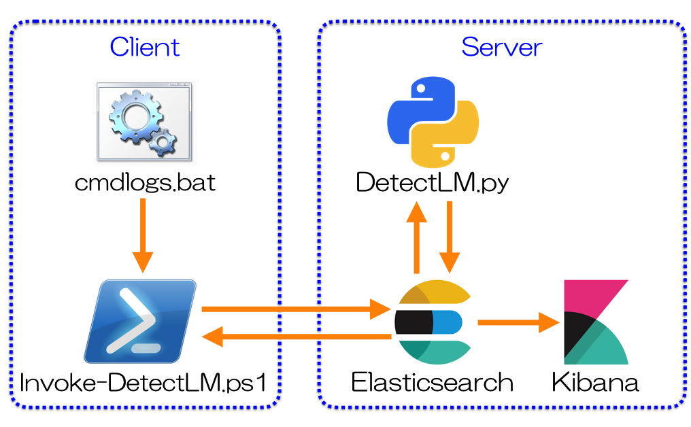
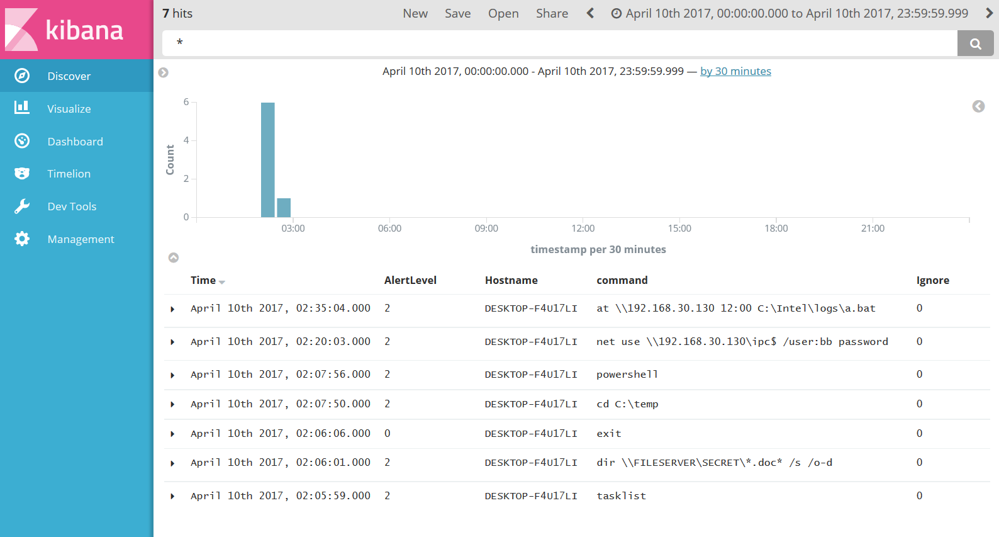
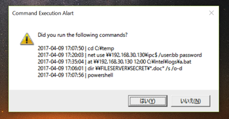
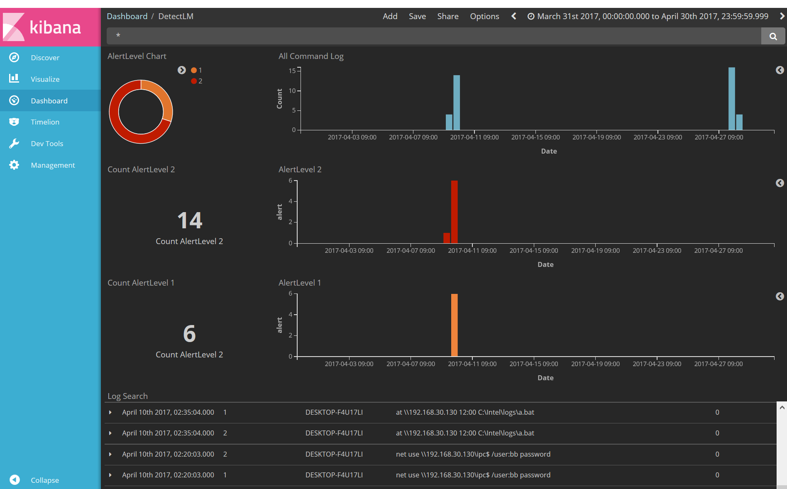

# DetectLM
  Detecting Lateral Movement with Machine Learning.  
  DetectLM is a proof of concept code to analyze and detect malicious commands executed via cmd.exe with machine learning.    

  

* **DetectLM.py**: Runs on server. Detect malicious Windows command execution using machine learning and blacklist.
* **Invoke-DetectLM.ps1**: Runs on client. Sends the logs to the Elasticsearch. Confirm analysis result and display alert message.
* **cmdlogs.bat**: Collect commands executed via cmd.exe.

## Requirements
  Each tools require the following modules:

### for Server

* Python3
* NumPy http://www.numpy.org/
* Pandas http://pandas.pydata.org/

### for Client

* PowerShell v3 or later

## Supported Client OS

* Windows 8.1
* Windows 10

## Usage

### for Server
1. Download and install [Elasticsearch](https://www.elastic.co/downloads/elasticsearch).  
2. Download and install [Kibana](https://www.elastic.co/downloads/kibana).  
3. Start Elasticsearch and Kibana.  
4. Download and save the DetectLM from Github.
  ```
  git clone https://github.com/JPCERTCC/DetectLM.git
  ```
5. And your Elasticsearch IP Address to **DetectLM/server/config/config.ini**.  
  ```
  els_server      = localhost
  ```
6. And mapping in Elasticsearch.
  ```
  $ python DetectLM.py -m
  ```
7. Create cron jobs for **DetectLM.py**.  
  For example  
  ```
  */15 * * * * python3.6 [Folder Name]/DetectLM.py
  ```

### for Client
1. Download **client/cmdlogs.bat** and **client/Invoke-DetectLM.ps1**.  
2. Register **cmdlogs.bat** in the registry entry that starts automatically when the cmd.exe is executed.  
  ```
  > reg add "HKEY_CURRENT_USER\Software\Microsoft\Command Processor" /v AutoRun /d [Downloaded Folder Name]\cmdlogs.bat
  ```
  or
  ```
  > reg add "HKEY_LOCAL_MACHINE\Software\Microsoft\Command Processor" /v AutoRun /d [Downloaded Folder Name]\cmdlogs.bat
  ```
3. Create a scheduled task for **Invoke-DetectLM.ps1**.
  ```
  > powershell -exec bypass .\Invoke-DetectLM.ps1 -ehost [Elasticsearch Server]
  ```

## How to Check Log
  Executed command logs can be checked from Kibana.  
  AlertLevel 2 is the malicious commands.

  

### AlertLevel
  The log has three levels of detection level  
* **2** : Error log reported by user
* **1** : Logs detected as malicious by machine learning
* **0** : No Alert (Default)

### Ignore Flag
  Ignore flag is automatically added to any command executed by the user.    
  When malicious Windows command execution is detected by machine learning, a notification will be sent to the client.  
  A user also can set a ignore flag to specific command execution when asked by client tool.  

  

### Dashboard
  Using Kibana dashboard, logs are visualized.  
  Example of dashboard is in **kibana_objects**. Import is [Management -> Saved Objects -> Import]

  

## Known Issues
* This tool supports Windows commands executed via cmd.exe. Any command via PowerShell are not logged nor monitored.
* Client tool has an issue when handling command line includes "/c" or "/k".
